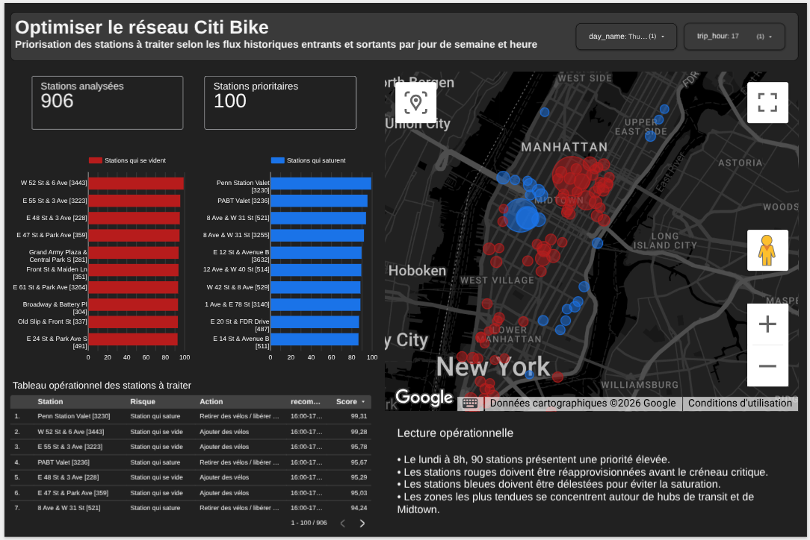
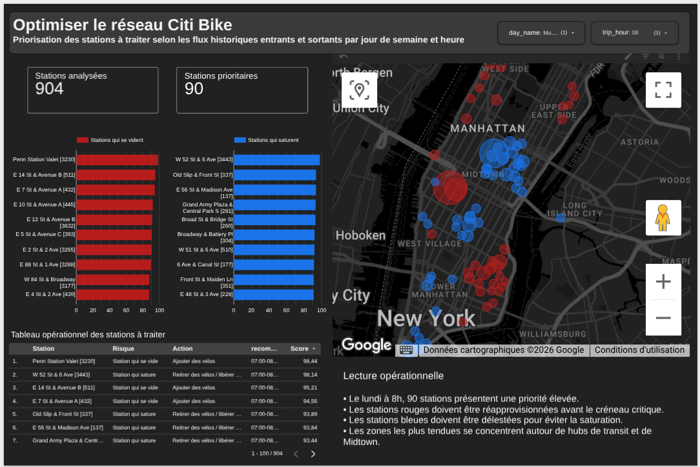
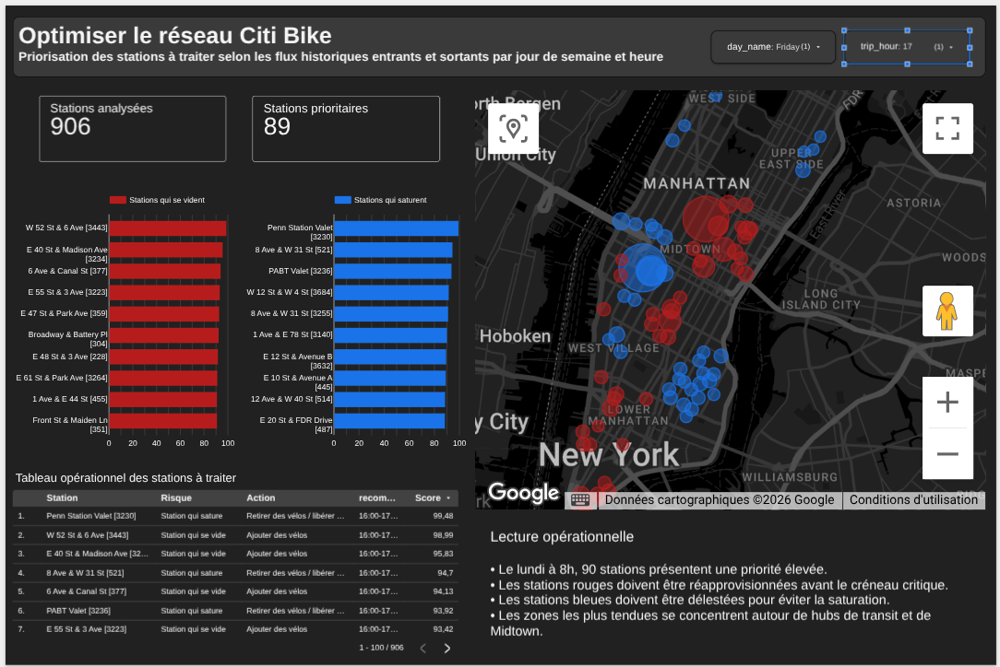

# Optimisation opérationnelle du réseau Citi Bike avec BigQuery et Looker Studio

Projet de Data Analytics / Business Intelligence réalisé avec BigQuery, SQL et Looker Studio à partir des données publiques NYC Citi Bike.

L’objectif du projet est de transformer des données de trajets brutes en un système d’analyse orienté décision permettant d’identifier :

- les stations qui ont tendance à se vider ;
- les stations qui ont tendance à se saturer ;
- les créneaux où les déséquilibres sont les plus forts ;
- les stations à prioriser pour le rééquilibrage opérationnel ;
- les actions à mettre en place selon le jour de semaine et l’heure.

---

## Vue d’ensemble

Ce projet porte sur l’optimisation du rééquilibrage du réseau Citi Bike à New York.

À partir des flux historiques entrants et sortants par station, j’ai construit un pipeline analytique structuré dans BigQuery, puis un dashboard Looker Studio orienté décision afin de répondre à une question business simple :

> Pour un jour de semaine et une heure donnés, quelles stations doivent être traitées en priorité pour fluidifier la répartition des vélos dans le réseau Citi Bike ?

Le projet a été structuré en plusieurs étapes :

- copie de la donnée brute dans BigQuery ;
- contrôle qualité et standardisation ;
- modélisation analytique en couches `raw`, `staging`, `fact` et `mart` ;
- création d’une table finale dédiée au dashboard ;
- construction d’un dashboard interactif dans Looker Studio ;
- synthèse business finale.

---

## Dashboard Looker Studio

Lien direct vers le dashboard :

[Accéder au dashboard Looker Studio](https://datastudio.google.com/s/iDVOF3E-Aak)

---

## Aperçu du dashboard

---

## Résultat en 30 secondes

J’ai construit une analyse opérationnelle de Citi Bike avec BigQuery et Looker Studio.

- Données : 53 097 208 trajets, 919 stations
- Période : juillet 2013 à mai 2018
- Objectif : prioriser les stations à traiter selon le jour et l’heure
- Stack : BigQuery SQL, Looker Studio, GitHub
- Résultat principal : un dashboard qui permet de choisir un jour de semaine et une heure pour identifier :
  - les stations qui se vident ;
  - les stations qui saturent ;
  - les stations prioritaires ;
  - l’action recommandée ;
  - la fenêtre d’intervention.

---

## Résumé exécutif

L’analyse met en évidence plusieurs enseignements clés :

- Les déséquilibres les plus critiques apparaissent principalement pendant les heures de pointe, notamment autour de 8h et de 17h–18h.
- Certaines stations présentent un comportement très régulier : elles se vident presque systématiquement à certaines heures, tandis que d’autres se saturent.
- Les hubs de transit et les zones de forte activité pendulaire concentrent une part importante de la tension réseau.
- Une logique de rééquilibrage basée sur les flux historiques permet de prioriser les interventions avant le créneau critique, plutôt que de réagir trop tard.
- Le dashboard final permet à un utilisateur métier de choisir un jour et une heure, puis d’identifier immédiatement où ajouter des vélos et où en retirer.

---

## Contexte business

Un opérateur de vélos en libre-service doit maintenir un niveau de service satisfaisant sur l’ensemble du réseau :

- éviter qu’une station soit vide au moment où des usagers souhaitent louer un vélo ;
- éviter qu’une station soit saturée au moment où des usagers veulent restituer leur vélo ;
- cibler efficacement les interventions de rééquilibrage ;
- concentrer les moyens opérationnels sur les stations et les créneaux les plus critiques.

Ce projet vise donc à transformer l’historique des trajets en recommandations opérationnelles actionnables.

---

## Question business

> Quelles sont les stations et les créneaux horaires à prioriser pour fluidifier la répartition des vélos dans le réseau Citi Bike ?

---

## Décision business à éclairer

Cette analyse vise à aider à prioriser les décisions suivantes :

- où ajouter des vélos avant un créneau critique ;
- où retirer des vélos pour éviter la saturation ;
- quelles stations surveiller en priorité ;
- quels créneaux nécessitent une intervention préventive.

---

## Dataset

Le dataset contient notamment :

- l’heure de départ du trajet ;
- l’heure d’arrivée du trajet ;
- la station de départ ;
- la station d’arrivée ;
- la durée du trajet ;
- les coordonnées des stations ;
- certaines informations utilisateur.

### Grain analytique

Le grain brut principal est le trajet Citi Bike.

### Population analysée

- 53 097 208 trajets
- 919 stations analysées

### Période étudiée

Juillet 2013 à mai 2018

### Limites du dataset

- absence d’historique fiable du stock réel de vélos par station et par heure ;
- le modèle ne montre pas le nombre réel de vélos disponibles en temps réel ;
- les recommandations reposent sur des patterns historiques de flux ;
- certaines stations partagent le même nom, d’où la création d’un identifiant visuel `station_label`.

---

## Stack utilisée

- BigQuery
- SQL
- Looker Studio
- GitHub

---

## Architecture analytique

Le projet a été structuré en quatre couches :

### `raw_citibike_trips`
Copie brute de la table publique des trajets Citi Bike.

### `raw_citibike_stations`
Copie brute de la table publique des stations Citi Bike.

### `stg_citibike_trips`
Table nettoyée et standardisée :

- contrôle des valeurs manquantes ;
- exclusion des durées aberrantes ;
- création des dimensions temporelles ;
- renommage des colonnes.

### `stg_citibike_stations`
Référentiel des stations :

- identifiant station ;
- nom station ;
- latitude / longitude ;
- géographie station.

### `fct_citibike_trips`
Table de faits centrale au grain trajet.

### `mart_station_global_priority`
Score global d’importance structurelle des stations dans le réseau.

### `mart_station_weekday_hour_rebalancing`
Table métier centrale au grain :

`1 ligne = 1 station × 1 jour de semaine × 1 heure`

Elle contient :
- les flux moyens entrants et sortants ;
- le déséquilibre moyen ;
- la régularité du problème ;
- le type de risque ;
- le score de priorité opérationnelle.

### `dashboard_rebalancing_decision`
Source finale utilisée dans Looker Studio.

---

## Logique du score

Le score final `day_hour_rebalancing_priority_score` est le meilleur score faisable avec les données disponibles.

Il combine :

- l’intensité du déséquilibre ;
- l’activité moyenne ;
- le déséquilibre relatif ;
- la régularité du problème ;
- la fiabilité du signal.

### Pondération du score

- 35 % intensité du déséquilibre
- 20 % activité
- 15 % déséquilibre relatif
- 20 % régularité
- 10 % fiabilité du signal

Les composantes sont normalisées à l’intérieur de chaque couple `jour de semaine × heure`, afin de comparer les stations entre elles dans un même contexte opérationnel.

---

## Sources de données du dashboard

### Source principale

`dashboard_rebalancing_decision`

Utilisée pour :
- les filtres `jour` et `heure` ;
- le KPI `Stations analysées` ;
- le KPI `Stations prioritaires` ;
- la carte des stations ;
- le top des stations qui se vident ;
- le top des stations qui saturent ;
- le tableau opérationnel.

---

## KPI principaux

- Stations analysées
- Stations prioritaires
- Score max
- Intensité du déséquilibre
- Type de risque
- Fenêtre d’intervention recommandée

---

## Dashboard final

Le dashboard permet de :

- choisir un jour de semaine ;
- choisir une heure ;
- identifier les stations qui se vident ;
- identifier les stations qui saturent ;
- localiser les stations prioritaires sur une carte ;
- afficher une action recommandée par station.

### Lecture visuelle

- Rouge : station qui se vide
- Bleu : station qui sature
- Taille du point : intensité du déséquilibre
- Tableau : vue actionnable pour les opérations

---

## Captures

### Dashboard final

### Exemple Monday 08

### Exemple Friday 17

---

## Démarche analytique

1. Vérification des tables publiques brutes
2. Contrôle qualité des trajets et des stations
3. Construction du staging
4. Création de la table de faits
5. Calcul du score global station
6. Construction de la table station × jour × heure
7. Construction de la table finale dashboard
8. Création du dashboard Looker Studio
9. Interprétation métier

---

## Recommandations opérationnelles

- Réapprovisionner avant les créneaux où certaines stations se vident régulièrement.
- Délester les stations qui saturent avant les pics de retour.
- Surveiller en priorité les hubs de transit et les zones pendulaires.
- Planifier les tournées de redistribution selon les couples `jour × heure` les plus critiques.

---

## Limites et pistes d’amélioration

- Ajouter un historique de stock réel des stations pour passer d’une logique de pression historique à une logique de service level réel.
- Ajouter les données temps réel pour un système d’alerte en production.
- Tester des modèles prédictifs horaires.
- Optimiser les tournées de rééquilibrage par zone.

---

## Limite méthodologique importante

Les recommandations reposent sur des patterns historiques de flux et non sur un stock temps réel des vélos.

---

## Auteur

Projet réalisé par Gauthier Antoine B.
